<div align="center">

# KOSyncthing+

[](https://github.com/d0nizam/kosyncthing_plus.koplugin/releases)
[](LICENSE)


[](https://github.com/d0nizam/kosyncthing_plus.koplugin/stargazers)

**Peer-to-peer file synchronisation integrated into KOReader.**

</div>

KOSyncthing+ is a KOReader plugin that embeds a fully managed [Syncthing](https://syncthing.net/) daemon right inside your e-reader. Books, annotations, and sidecar files stay in sync across all your devices, over your local network or the internet, without ever touching a third-party server.

---

## Contents

- [Why KOSyncthing+?](#why-kosyncthing)
- [Features](#features)
- [Supported devices](#supported-devices)
- [Android (remote mode)](#android-remote-mode)
- [Installation](#installation)
- [Migrating from koreader-syncthing or syncthing.koplugin](#migrating-from-koreader-syncthing-or-syncthingkoplugin)
- [First-time setup](#first-time-setup)
- [Menu reference](#menu-reference)
- [Automation](#automation)
- [Conflict resolution](#conflict-resolution)
- [Companion plugin API](#companion-plugin-api)
- [Translations](#translations)
- [Settings reference](#settings-reference)
- [Architecture overview](#architecture-overview)
- [Troubleshooting](#troubleshooting)
- [Acknowledgements](#acknowledgements)
- [License](#license)

---

## Why KOSyncthing+?

Two excellent projects laid the groundwork for running Syncthing on KOReader:

- **[jasonchoimtt/koreader-syncthing](https://github.com/jasonchoimtt/koreader-syncthing)** — the original, 320-star plugin that proved Syncthing could run comfortably on Kindle and Kobo hardware.

- **[bps/syncthing.koplugin](https://github.com/bps/syncthing.koplugin)** — a clean, focused reimplementation with automatic architecture detection (ARM / ARM64) and binary auto-download from GitHub Releases.

KOSyncthing+ stands on both of their shoulders. It takes those foundations and pushes them much further — a deep, polished KOReader menu, automation that truly understands e‑ink, smart Wi‑Fi management that never nags you, and a rich public API that lets other plugins integrate directly.

---

## Features

<details>
<summary><b>Quick Sync, folder & device management, pairing wizard, smart header, performance tuning, legacy support, binary management, maintenance, notifications …</b> – click to expand</summary>

### Quick Sync

Quick Sync is the one-tap sync flow designed for e-readers that are not left running continuously:

1. If Wi‑Fi is off, Quick Sync turns it on **silently** (no prompt).
   When the sync completes, Wi‑Fi is returned to its previous state —
   if it was off before, it is turned back off automatically.
   If Quick Sync is already in progress, tapping the button again shows
   a brief "already in progress" message instead of starting a second flow.
   If Wi‑Fi does not come up immediately, Quick Sync retries with
   **exponential backoff** (7 s → 14 s → 28 s → 56 s → 60 s, up to **2 minutes**
   total). If Wi‑Fi still cannot connect, it aborts with a clear
   message and releases all resources — the device is not kept awake.
   Periodic Sync will try again at the next scheduled interval;
   manual Quick Sync waits for the next tap.

2. Starts Syncthing, waiting up to 12 seconds for the daemon to initialise.

3. Checks disk space on every synced folder's filesystem — aborts if less than 100 MB free.

4. Triggers a forced rescan (`db/scan`) on every non-paused folder.

5. Polls folder status every 2 seconds, backing off to 10 seconds when no progress is detected.

6. Shows progress notifications: "Syncing… N items (X MB) remaining".

7. When all folders reach idle with zero `needItems`, reads per-device transfer stats and shows a summary:
   "Sync done — ↑ X sent, ↓ Y received" or "Sync done — everything up to date".
   During the sync, the smart status header updates to show the percentage
   complete (e.g. "Syncing… 45% (12 MB remaining)"). This works both for
   manual Quick Sync and for background sync when the daemon is running.

8. Stops Syncthing and releases the wakelock.

9. Times out after 30 minutes with a warning if folders are still not idle.

A **wakelock** (`preventSuspend` / `allowSuspend`) is held for the entire Quick Sync so the device does not sleep mid-transfer.

```mermaid
flowchart TD
    A([Quick Sync]) --> B{Wi-Fi on?}
    B -- No --> C["Turn on silently<br/>retry 7→14→28→56→60s"] --> D{Connected?}
    D -- No --> X[Abort · release all resources]
    B -- Yes --> E
    D -- Yes --> E["Start Syncthing<br/>(wait up to 12s)"]
    E --> F{At least 100 MB free?}
    F -- No --> X
    F -- Yes --> G[Rescan all folders] --> H["Poll status<br/>2s → 10s backoff"]
    H --> I{All idle · 0 needItems?}
    I -- "no, keep polling" --> H
    I -- "30 min timeout" --> W[Timeout warning] --> K
    I -- yes --> J[Show transfer summary] --> K[Stop daemon · release wakelock]
```



> [!TIP]
> When Syncthing is **already running**, the Quick Sync button becomes
> **Rescan all folders** and only triggers a rescan without stopping the daemon.

### Folder and device management

- **Per-folder status** — shows each folder's live state (Up to date, Syncing… N MB remaining, Scanning, Error, Paused) inside the Status menu.
- **Honest "Fix error"** — when a folder reports an error, the Status menu shows the real Syncthing message (not just a count). The folder's action button reads **"Fix error"** only when a rescan would actually clear it (a transient *„… changed during …"* error); for errors a rescan cannot fix (permission denied, no space, folder marker missing, I/O) it stays a neutral **"Rescan folder"**, so the UI never promises a fix it cannot deliver. The full error text is also included in **Copy diagnostic info**, tagged *rescan-fixable* or *needs attention*.
- **Pause / resume all folders** — the button label reflects the live paused count. When some folders are paused, it reads "Resume N paused folder(s)"; when all are active, "Pause all N folders".
- **Accept pending devices** — view and accept incoming pairing requests from the KOReader menu. After accepting, offers to share all existing configured folders with the new device in one tap.
- **Accept pending folders** — accept a folder shared by another device.
  The plugin suggests `<home_dir>/<folder_label>`; you can change the
  destination path before confirming. The folder is shared with the
  offering device, **and automatically enables `modTimeWindowS=2`
  together with other FAT‑friendly defaults** so the folder is ready for e‑reader
  storage without extra configuration.
- **Remove a folder** — remove a folder from Syncthing's config from the Status menu. Synced files on disk are not touched.
- **Pause / resume a single device** — pause an individual remote device from the Devices submenu.

### Guided pairing wizard

- Displays this device's ID as both plain text and a QR code with step-by-step instructions.
- Polls the Syncthing API for incoming pair requests using exponential backoff: 4 s → 8 s → 16 s → 30 s (capped), for fast response in the first two minutes and low API load during a longer wait.
- Abandons polling after 5 minutes with a clear message.
- On receiving a request, shows a name/ID confirmation dialog.
- Shows a periodic "Still watching… X min remaining" reminder so you
  always know the wizard is alive and how much longer it will wait.

### Smart status header

The top-level KOSyncthing+ menu entry shows a live one-line summary.
All possible states, in priority order:

| Priority | Header text | Tappable? |
|----------|-------------|-----------|
| 1 | `Not installed — use "Install Syncthing binary" below` | no |
| 2 | `Stopped — tap to start` | no |
| 3 | `âš  %1 file conflict(s) need attention` | **yes** |
| 4 | `Starting up…` | no |
| 5 | `âš  Errors in %1 folder(s)` | **yes** |
| 6 | `Syncing… X% (Y remaining)` | no |
| 7 | `All folders paused` | no |
| 8 | `Up to date · %1 device(s) online` | no |
| 9 | `Up to date · no devices online` | no |

- When Quick Sync or background sync is actively transferring files, the
  header shows the percentage complete (e.g. "Syncing… 45% (12 MB remaining)").

- The first match is shown (e.g. conflicts hide everything else).
- When the header **starts with `âš `**, it becomes **tappable** and the tap is
  routed by what is actually wrong, with a matching hint appended:
  - **Conflicts** → *" — tap to resolve"*; tap opens *Status & conflicts*.
  - **Errors a rescan can fix** (transient *"… changed during hashing/scan"*) →
    *" — tap to fix"*; tap rescans straight away — the same action as *Rescan all
    folders*. The *Rescan all folders* / *Quick Sync* button is also relabelled
    **Fix errors** in this state.
  - **Errors a rescan will not fix** (permission denied, no space, folder marker
    missing, I/O) → *" — tap to view"*; tap opens *Status & conflicts*, where the
    real error text is shown. *Status & conflicts* is also always reachable from
    its own row, independent of the header.
- When everything is fine, the header is greyed out and read‑only.
- On **Android (remote mode)** there is no local daemon to start, so the
  `Stopped — tap to start` state instead reads
  `Syncthing app not reachable — open it to sync`.
- `headerNeedsAction()` (in `st_health.lua`) drives both the tappable state
  and the hint text, so they can never get out of sync.

### Performance and network tuning

**Fine resource tuning** — applies additional per‑folder and per‑device limits that match the **currently active Resource profile** (Low or Normal). These limits are **not applied automatically** when you switch profiles — you must open **Setup → Fine resource tuning → Apply** to push the correct numbers to a running Syncthing instance. It does so via the Syncthing REST API (PATCH config/folders/{id} and PATCH config/devices/{id}):

| Setting | Low | Normal | v1.2.2 legacy |
|---------|-----|--------|---------------|
| `copiers` | 1 | 2 | ✅ applied |
| `hashers` | 1 | 2 | ✅ applied |
| `pullerMaxPendingKiB` | 16384 | 32768 | ✅ applied |
| `scanProgressIntervalS` | -1 | 10 | ✅ applied |
| `numConnections` (per device) | 1 | 2 | âš  skipped (added v1.20.0) |

A **Reset to defaults** option sets all values to Syncthing's built-in defaults.

**Resource profile (Low / Normal)** — applied at startup by the `start-syncthing` shell script via Go runtime environment variables, plus additional API-level options three seconds after start:

| | Low | Normal | v1.2.2 legacy |
|-|-----|--------|---------------|
| `GOMEMLIMIT` | 64 MiB | 128 MiB | ✅ applied (env var) |
| `GOGC` | 50 | 100 | ✅ applied (env var) |
| `GOMAXPROCS` | 1 | 1 | ✅ applied (env var) |
| `maxConcurrentIncomingRequestKiB` | 32768 | 262144 | âš  skipped (added v1.4.0) |
| `maxFolderConcurrency` | 1 | 0 | âš  skipped (added v1.4.0) |

> **v1.2.2 note:** Go runtime environment variables (`GOMEMLIMIT`, `GOGC`) are
> set by `start-syncthing` regardless of binary version and provide the primary
> memory protection on constrained devices.  The API-level limits are
> supplementary and are safely skipped on v1.2.2.
> All configuration mutations (add/remove folders and devices,
> pause, resume, patch settings) are handled via transparent shims, so
> there is no loss of functionality. Only the fine‑tuning options listed
> above are skipped because the corresponding config fields did not exist
> in that version.

**Automatic FAT/FUSE tuning**  
Every time Syncthing starts, the plugin checks all configured folders.  
If a folder lives on a FAT or FUSE filesystem (the default on Kindle and Kobo),  
it automatically applies the following safe defaults:

  • `modTimeWindowS = 2` – prevents spurious conflicts caused by the
    2‑second timestamp resolution of these filesystems.
    *(Skipped for legacy v1.2.2 — that version had built-in FAT detection
    before this field was introduced in v1.11.0.)*
  • `ignorePerms = true` – avoids conflicts from permission mismatches
    between Linux and FAT/FUSE.
  • `syncOwnership = false` / `sendOwnership = false` – prevents
    ownership tracking, which is not supported on FAT/FUSE.
    *(Skipped for legacy v1.2.2 — ownership sync did not exist in that
    version, so disabling it is unnecessary.)*

These changes are **applied automatically at startup** for all folders,
so no manual action is needed.  
The **Fine resource tuning** menu item still handles **profile‑specific**
settings (copiers, hashers, pullerMaxPendingKiB, etc.) and can reset
everything to defaults if needed.

**Network access (LAN only / Global)** — applied via `PATCH config/options` three seconds after startup:

| Option | LAN only | Global | v1.2.2 legacy |
|--------|----------|--------|---------------|
| `globalAnnounceEnabled` | false | true | ✅ applied |
| `relaysEnabled` | false | true | ✅ applied |
| `natEnabled` | false | true | ✅ applied |
| `crashReportingEnabled` | false | true | ✅ applied |
| `autoUpgradeIntervalH` | 0 | 12 | ✅ applied |
| `urAccepted` | -1 | 0 (if not already set) | ✅ applied |

LAN only also passes `--no-upgrade` to the daemon and sets `STNOUPGRADE=1`.

### Legacy Syncthing support

> [!WARNING]
> **Experimental — this feature may not work as intended.** Legacy mode
> has **not been tested on real old-kernel hardware** — the author has no
> such device. Its decision logic (kernel detection and version selection),
> the GitHub download URLs, and the v1.2.2 API-compatibility shim are covered
> by an offline test suite (`spec/st_legacy_spec.lua`, 69 tests), and the
> download URLs were confirmed against Syncthing's published release assets.
> But the full on-device path — downloading a years-old Syncthing build,
> launching it on a 2.6.x/3.0.x kernel, and actually syncing — has never been
> exercised on a device. Treat it as best-effort: it may fail in ways the
> offline tests cannot catch, **especially on the v1.2.2 path** for the
> oldest kernels. If you try it, please report the result (whether it works
> or not, with any error text) on the issue tracker so it can be improved.

Some e-readers run a Linux kernel older than 3.2 (for example, the Kindle
Paperwhite 1st Generation with kernel 2.6.31).  The Go runtime used by
current Syncthing releases requires kernel ≥ 3.2; starting the daemon on an
older kernel produces an immediate fatal crash:

```
runtime: epollwait on fd 4 failed with 38
fatal error: runtime: netpoll failed
```


Legacy mode solves this by running a separate, older Syncthing binary that
was compiled with a Go version compatible with the device's kernel:

- **v1.27.12** — for kernels 2.6.32–3.1 (recommended).  Full modern REST
  API; all plugin features work identically to the standard binary.

- **v1.2.2** — very old kernels below 2.6.32 (e.g. Kindle PW1). Pre-dates the
  modern `/rest/config` API. The plugin transparently translates all
  configuration changes (adding/removing devices and folders, pausing,
  patching settings) through a read‑modify‑write shim, so the full
  folder/device management works exactly as with the standard binary.
  Only the features listed in the table under *Performance and network
  tuning* are skipped or adjusted.

**Automatic detection** — on first load the plugin silently classifies the
kernel via `uname -r` into one of three states: *old* (< 3.2, needs legacy),
*modern* (≥ 3.2, runs the standard binary), or *unknown* (could not be read).
If the kernel is old and legacy is not yet configured, a non-intrusive hint
appears suggesting **Setup → Legacy Syncthing**.

**Guided setup** — enabling legacy mode is one decision, not a quiz.
**Setup → Legacy Syncthing → Set up Legacy mode…** detects the right version
for the device's kernel, downloads it, and offers to start Syncthing straight
away.  A *Choose version manually* option remains for the rare case where the
detected kernel is misleading.

**Isolated state** — the legacy daemon uses its own config directory
(`settings/syncthing-legacy/`) separate from the standard one
(`settings/syncthing/`).  Each binary has its own API key, TLS certificate,
and device ID.  This means re-pairing is required when switching modes, but
it prevents config-schema corruption that would occur if two binaries with
different config-field sets shared the same `config.xml`.

**Binary management** — the legacy binary (`syncthing-legacy`) is downloaded
as part of the guided setup, or re-downloaded later via **Setup → Legacy
Syncthing → Re-download legacy binary**.  The selected version is recorded on
disk, so the plugin refuses to start a binary that does not match the chosen
version.  Factory reset and plugin removal clean up both directories.

### Binary management

- **First-run download prompt** — if no Syncthing binary is present, starting the plugin presents a friendly dialog explaining what Syncthing is and offering to download it. No technical knowledge required.
- **Auto-download from official releases** — fetches the correct binary for your device architecture (ARM 32‑bit or ARM64) from the official [syncthing/syncthing](https://github.com/syncthing/syncthing/releases) GitHub Releases page.
- **Architecture verification before download** — detects `uname -m` and selects the matching `linux-<arch>` tarball. Shows a warning dialog if the architecture is unrecognised and lets you decide whether to proceed.
- **Architecture check before start** — verifies the installed binary matches the device before attempting to launch. Refuses to start with an informative error if there is a mismatch.
- **Size sanity check** — after downloading, verifies the file is within 75%–125% of the expected size. Rejects corrupted or truncated downloads before attempting extraction.
- **In-place update** — if Syncthing is running when a new binary is installed, the plugin stops it, installs the binary, and restarts silently.
- **Free space check** — requires at least 20 MB free before starting a download.
- **Download transport** — uses `curl` (with `cacert.pem` for certificate verification) when available, falls back to LuaSec (HTTPS), then LuaSocket (HTTP).
- **Atomic install** — binary is installed via a temporary `.new` file that replaces the current one only after ELF and size checks pass.

### Starting and stopping

- **Architecture-aware start guard** — refuses to start a binary that does not match the device CPU.
- **Loopback interface management (Kobo)** — on Kobo devices, brings up the `lo` interface with `ifconfig lo up` / `ip link set lo up` if it is down, since Syncthing communicates with its own REST API over `127.0.0.1`.
- **Kindle firewall** — opens the Web GUI port, sync port (22000/TCP) and local discovery port (21027/UDP) in `iptables` before starting, removes all three on stop. Fixes the pairing "connection refused" problem on Kindle.
- **Re-entrancy guard** — a `_starting` / `_stopping` flag prevents two concurrent start or stop operations from racing on rapid taps.
- **Clean shutdown** — sends `SIGTERM`, polls for up to 4 seconds, then sends `SIGKILL`. On device suspend, uses a synchronous 1-second sleep so the kernel does not pause Syncthing's I/O mid-flush.
- **Silent start** — auto-start and periodic sync bypass the "Syncthing started" toast; only user-initiated starts show a notification.
- **Auto-merge after sync** — opt-in setting in the Automation menu; after each Quick Sync, reading-progress conflicts are merged automatically (higher progress wins). Disabled by default.

### Maintenance

- **View logs** — displays `settings/syncthing/syncthing.log` in a KOReader text viewer. The log is capped at 5 MB with 1 rotation file (--log-max-size / --log-max-old-files). Total disk usage for logs never exceeds about 10 MB.
- **Clear log file** — deletes the log; a new one is created on the next start.
- **View errors only** — filters the log to show only `[WARNING]` and `[ERROR]` lines, making it easier to spot problems without scrolling through the full output.
- **View API errors (N)** — shows up to 8 recent REST API errors (the number is shown in the menu label).
- **Clear all API errors** — removes all stored API errors.
- **Copy diagnostic info** — collects plugin version, Syncthing version, running state, port, binary file status (ELF check, architecture, size), process details (RSS, threads, CPU time), filesystem type & free space, network state (loopback, IP, Kindle firewall ports), folder/device counts, database location, last 5 API errors, the last 5 Syncthing log entries, and the last 5 plugin WARN/ERROR lines. Displays the result as a QR code (scan with your phone) and copies the same text to the clipboard. Paste into a bug report or support request.
- **Copy API key** — copies the Syncthing REST API key to the clipboard.
- **Reset sync database** — deletes the index database directory, forcing a full re-index on the next start. Stops Syncthing first if running.
- **Reset everything to factory defaults** — double-confirmed destructive reset: stops Syncthing, deletes `settings/syncthing/` entirely (config, TLS keys, device ID, database), wipes all `syncthing_*` keys from KOReader settings, and resets all in-memory plugin state. Synced files on disk are **not** deleted.  After stopping Syncthing, the reset verifies that the daemon has actually exited before wiping any files. If Syncthing cannot be stopped (e.g. due to a kernel I/O hang), the reset is refused with a clear message.
- **Restart Syncthing** — stop and start in one tap.
- **Download / update Syncthing** — fetch the latest binary from GitHub Releases.

### Notifications

- Configurable on/off globally via **Show notifications** in the Automation menu.
- Queued: on e-ink devices, simultaneous toasts render on top of each other and become unreadable. All notifications pass through a queue that waits for each toast's timeout before showing the next one.

</details>

---

## Supported devices

This plugin is tested and confirmed working on:

| Platform | Device | Notes |
|----------|--------|-------|
| Kindle | **Paperwhite 12th Generation (2024)** | Standard mode |
| Kindle | **Basic 10th Generation (2019)** | Standard mode |
| Kobo | **Libra Colour (2024)** | Standard mode |

(Please send pull requests to add your tested device here!)

Because Syncthing itself is cross‑platform, the plugin should work on any
Linux‑based e‑reader that runs KOReader (Kobo, other Kindle models, etc.),
but these have **not been explicitly verified**.

### Older devices (kernel < 3.2)

Devices with kernels older than 3.2 require **Legacy mode**.  The plugin
detects the kernel version on first load and guides you to the right binary:

| Kernel range | Binary | Example devices |
|-------------|--------|-----------------|
| ≥ 3.2 | Standard (latest) | Kobo Libra 2, Kindle PW4/5/12 |
| 2.6.32–3.1 | Legacy **v1.27.12** | Kobo Touch 2, Kindle PW2/PW3 |
| < 2.6.32 | Legacy **v1.2.2** | Kindle PW1, Kindle Touch |

> ✅ **Android is supported in remote mode.**  
> On Android the plugin does **not** run its own daemon; instead it connects as a
> REST client to a Syncthing **app** that you install separately, such as
> [Syncthing-Fork](https://github.com/Catfriend1/syncthing-android) or
> [BasicSync](https://github.com/chenxiaolong/BasicSync).  
> See **[Android (remote mode)](#android-remote-mode)** below for setup and details.

The Syncthing binary is **not** included in the plugin ZIP — it is
downloaded on first use and the downloader detects your architecture
automatically.

---

## Android (remote mode)

On Android the plugin runs in **remote mode**: it does not download or manage a
Syncthing binary itself.  Instead it talks to a Syncthing **app** that already
runs the daemon on `127.0.0.1` — for example
[Syncthing-Fork](https://github.com/Catfriend1/syncthing-android) or
[BasicSync](https://github.com/chenxiaolong/BasicSync).  The plugin becomes a
thin client of that app's REST API, so the conflict-resolution and reading-tools
parts of the plugin work exactly as on Kindle/Kobo while daemon management stays
with the app.

**Setup**

1. Install and start a Syncthing app on the device.
2. In the app, open its **Web GUI** (usually `http://127.0.0.1:8384`) or settings
   and copy the **API Key**.
3. In KOReader, open **Tools → KOSyncthing+ → Connect to the Syncthing app** and
   paste the key.  The plugin probes both `https` and `http`, remembers whichever
   the app uses, and reuses it on every later launch.

The plugin reaches the API with an `X-API-Key` header and accepts the app's
self-signed certificate (`verify = none`), so both plain-HTTP and HTTPS apps —
including BasicSync — work without extra configuration.

**What works on Android**

- **Status & conflicts** — the core feature: conflict files are found by scanning
  the synced folders, and the same auto-merge / keep-local / keep-remote
  resolution runs entirely on the local filesystem.
- **Rescan all folders**, **Pause / resume all folders**
- **Pair with another device**, **Web GUI access** (address + QR)
- **Copy diagnostic info**
- Gestures: **Quick Sync** (rescan) and **Pause / resume all**

**What is not shown (handled by the Syncthing app instead)**

Installing/starting/stopping the daemon, automation (auto-start, periodic sync),
logs, database reset, restart, the GUI password, the listen port, the resource
profile, and the network mode (LAN-only vs relays + global discovery) all belong
to the Syncthing app's own settings, so the plugin does not duplicate them.
Network-mode changes in particular only take effect after the Syncthing app is
restarted — something the plugin can't do — so they are intentionally left to
the app.  On Android the menu is a dedicated, shorter **KOSyncthing+** menu
that offers only the items above.

> **Note:** This is a remote client, not a substitute for the Syncthing app — the
> app must be installed and running for syncing to happen.

---

## Installation

### Install

1. Download the latest **kosyncthing_plus.koplugin.zip** from [Releases](../../releases).
2. Extract the `kosyncthing_plus.koplugin/` folder into your KOReader plugins directory:

   | Device | Plugins directory |
   |--------|-------------------|
   | Kobo | `/mnt/onboard/.adds/koreader/plugins/` |
   | Kindle | `/mnt/us/koreader/plugins/` |
   | Android | `/koreader/plugins/` |

3. Restart KOReader. The plugin appears as **KOSyncthing+** in **☰ → Tools**.

### Migrating from koreader-syncthing or syncthing.koplugin

Your existing Syncthing configuration migrates automatically — no need to re-pair devices or re-add folders.

Both predecessor plugins store their configuration in the same location that KOSyncthing+ uses:

```
settings/syncthing/config.xml   ← device ID, folders, paired devices, API key
settings/syncthing/cert.pem     ← TLS identity (device ID is derived from this)
settings/syncthing/key.pem
```

When KOSyncthing+ starts for the first time it finds this directory and uses it as-is. Your device ID, all paired devices, all configured folders, and their sync states are preserved.

The only manual step is downloading the Syncthing binary via **Maintenance → Download / update Syncthing**, since KOSyncthing+ manages its own copy of the binary separately from whichever binary the old plugin used.

---

## First-time setup

<details>
<summary><b>Step-by-step: download binary, set password, pair, accept folders, sync</b></summary>

### 1 — Download the Syncthing binary

Open **☰ → Tools → KOSyncthing+ → Start Syncthing** (or **Install Syncthing binary** if no binary is present).

Because no binary is installed yet, a welcome dialog appears. Tap **Download**. The plugin detects your architecture and fetches the correct binary from the official Syncthing GitHub Releases (~10–15 MB). Wi-Fi is required.

If auto-download fails (no network, rate-limited, etc.), install manually:

1. Download the Linux ARM or ARM64 build from [syncthing.net/downloads](https://syncthing.net/downloads/).
2. Extract the `syncthing` binary and copy it to `kosyncthing_plus.koplugin/syncthing` inside your plugins folder.
3. Make it executable: `chmod +x syncthing`.

### 2 — Set a GUI password

> [!IMPORTANT]
> The Syncthing binary must already be downloaded and started at
> least once before a password can be set – the daemon creates `config.xml` on
> first launch, and the plugin writes the password into that file.

**If you followed step 1** (binary was downloaded and launched):
About 4 s after KOReader starts, if a binary is present but no password is
configured, the plugin prompts you to set one. You can also do this at any
time via the **KOSyncthing+** menu under **Setup → Web GUI password**.

> **Do this before connecting to a network that others can reach.**
> The Syncthing Web UI listens on `0.0.0.0:8384`. Anyone on your local
> network can open it until a password is set.

### 3 — Pair with another device

Open **Setup → Pair with another device**. The wizard shows your device ID and a QR code. On your other device, open Syncthing and add this e-reader by scanning the QR code or entering the ID manually. As soon as the other device sends a pairing request, the wizard detects it and shows a confirmation dialog.

### 4 — Accept shared folders

After pairing, your sync partner can share folders with you. Open the **KOSyncthing+** menu, go to **Status & conflicts** and check the **Pending** section. When you accept a folder, the plugin suggests placing it at `<home_dir>/<folder_label>`, but you can edit the path before confirming. You can choose any path you like — the plugin only refuses system directories (like /proc, /sys, /dev) and paths with .. for security reasons.

### 5 — Sync

Tap **Quick Sync**. The plugin starts Syncthing, waits for all folders to finish, shows a transfer summary, and stops the daemon.

</details>

---

## Menu reference

<details>
<summary><b>Full menu tree</b></summary>


```
KOSyncthing+                                   ← top‑level entry
│
├── [status line]                            ← smart one‑line header
│   • Normally read‑only and greyed out.
│   • When conflicts or folder errors exist,
│     the line starts with ⚠ and becomes
│     tappable — tapping opens Status &
│     conflicts right away.
│   • The appended hint (" — tap to resolve"
│     or " — tap to view") tells you exactly
│     what to do.
│   • If nothing needs attention the line
│     simply says "Up to date" or "Stopped".
│   • Long‑press performs the most likely
│     desired action given the current state:
│     start Syncthing if stopped, open
│     conflicts if any exist, or run a
│     Quick Sync if everything is up to date.
│
├── Start Syncthing / Stop Syncthing /
│   Install Syncthing binary                 ← changes label by state:
│     • no binary → "Install Syncthing binary"
│     • installed & stopped → "Start Syncthing"
│     • running → "Stop Syncthing"
│
├── Quick Sync / Rescan all folders          ← label adapts to daemon state:
│     • stopped → "Quick Sync"
│       (start → scan → wait → stop, shows
│       transfer summary at the end)
│     • running → "Rescan all folders"
│       (only triggers a fresh scan,
│       daemon stays up afterwards)
│
├── Pause all N folders /
│   Resume N paused folder(s)                ← label shows live paused count:
│     • no paused folders → "Pause all N folders"
│     • some paused → "Resume N paused folder(s)"
│     • all paused → "Resume all N folders"
│
├── Status & conflicts (N)                   ← badge = number of conflicts
│   │                                         also contains pending devices
│   │                                         & folders when there are any
│   │
│   ├── [dashboard bullets]                  ← read‑only health summary:
│   │   folder states, online devices, etc.
│   │
│   ├── ── Pending ──                        ← only shown when at least one
│   │   │                                     pending request exists
│   │   ├── <device name>  (device)          ← tap: Accept or Ignore
│   │   └── <folder label> (folder)          ← tap: Accept or Ignore
│   │
│   ├── <folder name>: Up to date / Syncing… / Paused
│   │   │                                     live state from cached health
│   │   └── Tap → ConfirmBox with three actions:
│   │       [Pause / Resume]                 ← toggle; label changes instantly
│   │       [Full details]                   ← opens scrollable info page
│   │       [Remove folder]                  ← confirm; files on disk stay
│   │
│   ├── <device name>: Connected / Last seen: …
│   │   │                                     live connection status
│   │   └── Tap → ConfirmBox with two actions:
│   │       [Pause / Resume]                 ← toggle single device
│   │       [Full details]                   ← ID, address, last-seen time
│   │
│   └── ── Conflicts (N) ──                  ← only shown when conflicts exist
│       ├── Resolve all N conflicts…          ← bulk strategy dialog with
│       │   three buttons:                     Auto‑merge progress (keeps
│       │   Keep ALL mine / Use ALL theirs     higher reading progress for
│       │                                      metadata sidecar files)
│       ├── <conflict file 1>                ← tap for per‑file dialog:
│       │   metadata with progress → Mine vs Theirs (percent)
│       │   other files → timestamps + "which is newer"
│       │   original missing → Keep as new file / Discard
│       └── … and N more (use bulk resolve)   ← shown when > 50
│
├── Setup
│   ├── Web GUI access                       ← shows URL + optional QR code
│   ├── Pair with another device             ← guided wizard (QR + auto‑detect)
│   ├── Web GUI password                     ← set or remove; prompts to stop
│   │                                         daemon if running
│   ├── Web GUI port                         ← default 8384;
│   │   prompts to stop daemon if running
│   ├── Resource profile                     ← Low (64 MiB RAM) / Normal (128 MiB);
│   │   on change: folder & device API tweaks
│   │   applied instantly; memory & CPU limits
│   │   prompt a Syncthing restart
│   ├── Fine resource tuning                 ← Apply via API or Reset to defaults;
│   │   uses three‑button dialog (Apply /
│   │   Reset to defaults / Cancel)
│   ├── Network access                       ← LAN only / Global;
│   │   applied immediately when running
│   └── Legacy Syncthing [⚠ when needed]   ← shown only when the kernel is
│       │                                    too old (< 3.2), OR legacy is
│       │                                    already enabled, OR the kernel
│       │                                    is unknown and a start failed.
│       │                                    A modern-kernel device never
│       │                                    sees this entry.
│       ├── Set up Legacy mode… /            ← when OFF: opens guided setup
│       │   Legacy mode: ON (vX.Y.Z)            (auto-detects version, offers
│       │                                       to download and start).
│       │                                    when ON: tap to disable.
│       ├── Legacy version: v1.27.12 / v1.2.2 ← only when enabled; manual
│       │   version override picker
│       └── Re-download legacy binary (vX.Y.Z) ← only when enabled; offers
│           to start Syncthing after install
│
├── Automation
│   ├── Show notifications                   ← on/off; when off no completion
│   │   or conflict toasts appear
│   ├── Autostart Syncthing         ← actively turns Wi‑Fi on when needed; stops when Wi‑Fi disconnects
│   ├── Periodic Quick Sync                  ← on/off; runs at chosen interval
│   ├── Sync interval: X min  ·  next in Y min ← hidden when disabled;
│   │   shows live countdown to next sync
│   ├── Auto-merge conflicts after sync      ← opt-in; merges reading-progress
│   │   conflicts automatically after every Quick Sync; off by default
│   └── Apply automation only when charging  ← gates all automation; greyed
│       out when no automation is active
│
└── Maintenance
    ├── View logs                             ← opens scrollable log viewer
    ├── Clear log file                        ← deletes log; new one created on
    │   next start
    ├── View errors only                      ← filters log to show only [WARNING]
    │   and [ERROR] lines
    ├── View API errors (N)                   ← shows up to 8 recent REST API errors;
    │   only active when errors are stored
    ├── Clear all API errors                  ← removes all stored API errors
    ├── Copy diagnostic info                  ← version, running state, last 5 API
    │                                           errors and last 5 WARN/ERROR log
    │                                           lines; shown as QR code + clipboard
    ├── Copy API key                          ← copies REST API key to clipboard;
    │                                           only active when a key exists
    ├── Reset sync database                   ← prompts to stop daemon if running;
    │   deletes index files, forces full
    │   re‑index on next start
    ├── Reset everything to factory defaults  ← double‑confirm; wipes config,
    │   database, device ID, all plugin
    │   settings; synced files on disk are
    │   NOT deleted
    ├── Restart Syncthing                     ← only active when running;
    │   stops and starts silently (no toast)
    └── Check for updates  (vX.Y.Z installed) /
        Install Syncthing binary              ← downloads latest binary from
        GitHub Releases; Wi‑Fi required
```

</details>

---

## Automation

<details>
<summary><b>Notifications, autostart, periodic sync, auto-merge after sync, charging gate, dispatcher actions</b></summary>

### Show notifications

Notifications are **enabled by default**.
Controls whether completion toasts appear outside the KOSyncthing+ menu.
When **on** (checked) you get brief, self‑dismissing messages for
successful Quick Sync, detected conflicts, and automation errors.
When **off** all background activity stays completely silent.

Notifications are queued so two messages never overlap on screen.

### Autostart Syncthing

Automatically start Syncthing and keep it running whenever possible.
• Wi-Fi will be turned on automatically when needed.
• If Wi-Fi cannot be turned on, Syncthing will not start.
• A health-check timer runs every 60 seconds: if Syncthing
should be running but isn't, it tries to start it again.
• When Wi-Fi disconnects, Syncthing stops automatically.
• Works also on LAN-only networks without internet access.
• Manually stopping Syncthing pauses auto-start for the rest of this session — it starts again next time you open KOReader. Turn this off to stop it permanently.

### Periodic Quick Sync

Schedules a full Quick Sync every N minutes (1–1440, default 30).
The Automation menu shows **"Next sync in: X min"** live.

**Wi‑Fi behaviour**
- If Wi‑Fi is **already on** (you turned it on manually), Periodic Sync
  uses the existing connection, performs the sync, and **leaves Wi‑Fi on**
  afterwards.

- If Wi‑Fi is **off**, the plugin turns it on before the sync and restores it
  according to your KOReader Wi‑Fi settings afterwards.

- If Wi‑Fi cannot be turned on immediately, Periodic Sync retries with
  **exponential backoff** (30 s → 60 s → 120 s → 240 s, up to **8 minutes**
  total). If Wi‑Fi still cannot connect, it skips this cycle silently
  and waits for the next scheduled run — no manual intervention is
  needed.

- The plugin uses KOReader's enableWifi to bring up Wi‑Fi automatically when needed.
  On platforms where this is not possible, the sync may be skipped.

**Required KOReader Wi‑Fi settings**

Because the plugin uses KOReader's internal `enableWifi` API with
`interactive=false`, it can bring up Wi‑Fi by itself without any prompts,
regardless of the **Action when Wi‑Fi is off** setting. The **Action when
done with Wi‑Fi** setting is still respected: if it is set to `turn off`,
the plugin will switch Wi‑Fi off after a periodic sync.

> You can still configure those settings in **☰ → ⚙ → Network** – they
> affect manual Quick Sync and other parts of KOReader, but they are no
> longer required for KOSyncthing+'s automation.

### Sync interval

Opens a number picker to set the interval in minutes (1–1440).
When Periodic Quick Sync is off, this row is greyed out.

### Auto-merge conflicts after sync

When enabled, every Quick Sync that completes triggers an automatic scan for
reading-progress conflicts. For each KOReader metadata (`.sdr`) conflict, the
copy with the higher `percent_finished` wins. Non-metadata files are skipped.

- **Off by default.** Enable only once you are comfortable with the manual
  *Auto-merge progress* action in Status & conflicts.
- A brief notification appears only when merges actually occur or when one
  fails — silent syncs that have no conflicts produce no notification.
- The *Show notifications* master switch in this menu still applies; with
  notifications off, no toast is shown even when merges happen.
- Uses the same engine as the manual auto-merge action, so the result is
  identical to running it by hand.

### Charging gate

When enabled, all automation — auto‑start and periodic sync — fires
**only** when the device is plugged in and charging.

### Resume after suspend

If Syncthing was running before sleep, it starts again automatically when
the device wakes up (needs Wi‑Fi; if you turned on "charging only", the
device must also be plugged in). With Periodic Quick Sync enabled, an
immediate sync runs on resume so nothing is missed.

### Dispatcher actions

The plugin registers three actions that you can bind to gestures or
hardware buttons in KOReader's Gesture Manager:

- **Toggle Syncthing** — start or stop the daemon.
- **Quick Sync** — run a one‑shot sync.
- **Pause / resume all folders** — toggle the pause state of all folders.

Bind these to a gesture in KOReader's Gesture Manager, or open the menu directly via <kbd>☰</kbd> → **Tools → KOSyncthing+**.

</details>

---

## Conflict resolution

<details>
<summary><b>Per-file and bulk resolution strategies</b></summary>

Syncthing creates `filename.sync-conflict-YYYYMMDD-HHMMSS-DEVID.ext` files when two devices modify the same file concurrently. The plugin scans all configured folder paths for these files and surfaces them in **Status & conflicts → Conflicts (N)**.

### Per-file resolution

The dialog shown depends on the file type:

**KOReader metadata sidecar** (`*.sdr/metadata.*.lua`) **with reading progress:**
- Shows "Your device: X%" vs "Other device: Y%".
- Tap **Mine (X%)** or **Theirs (Y%)** to keep that version.
- Both `percent_finished` (current KOReader format) and `last_percent` (pre-2022 format) are recognised; a dialog is shown if either side has either field.
- When the conflict copy carries **this device’s** short ID (Syncthing set your own version aside when a remote write arrived first), the labels switch to **Keep incoming (X%)** / **Restore mine (Y%)** — incoming progress vs your own — so you don’t accidentally keep the wrong reading position.

**Any other file (or metadata without progress):**
- Shows both modification timestamps with a hint ("→ Your version is newer." etc.).
- Tap **Mine (timestamp)** or **Theirs (timestamp)**.
- When the conflict copy carries **this device’s** short ID (Syncthing moved your own version aside when a remote write arrived first), the labels switch to **Keep incoming** / **Restore mine** so the intent is unambiguous.
- When the device that created the conflict copy is known and reachable, its name is shown alongside the timestamp (e.g. “2026-01-01 12:00 (Phone)”).

**Original file missing:**
- **Keep as new file** renames the conflict copy to the original path.
- **Discard it** deletes the conflict copy.

### Bulk resolution

The **Resolve all N conflicts…** option offers three strategies:

- **Auto-merge progress** — for each KOReader metadata conflict where at least one side has `percent_finished` (or the legacy `last_percent`), keeps whichever has the *higher* reading progress. Non-metadata files and conflicts where neither side has a progress value are skipped. Shows a summary: "Merged N — kept local for X, kept remote for Y, skipped Z."
- **Keep ALL mine** — discards every conflict copy.
- **Use ALL theirs** — replaces every local file with its conflict copy.

Each row is labelled by the book or file the conflict belongs to — for reading-progress conflicts the book name rather than the internal `metadata.*.lua` — with the time Syncthing recorded the conflict shown on the right. The conflict list is capped at 50 visible entries; a note prompts you to use bulk resolve if more exist.

</details>

---

## Companion plugin API

<details>
<summary><b>Public API for other KOReader plugins</b></summary>

The plugin exposes a rich public API for other KOReader plugins.  
All methods are documented in detail in **[API.md](API.md)**.

A quick overview of what's available:

- **Status** – `isRunning`, `getConflicts`, `getFolderHealth`, `getStatusHeader`, `getDeviceId`
- **Control** – `start`, `stop`, `quickSync`, `toggle`, `pauseAllFolders`, `resumeAllFolders`
- **Conflict resolution** – `resolveAllConflicts` (keep_local / use_remote / auto_merge), `resolveConflictByPath`
- **Information** – `getFolders`, `getDevices`, `getPendingDevices`, `getPendingFolders`, `getConflictsDetailed`, `getFolderIgnore`, `setFolderIgnore`
- **Proxied REST call** – `apiCall(endpoint, method, body)` — talk to Syncthing without ever seeing the API key
- **Events** – `onStatusChange` / `offStatusChange` (custom listeners) and KOReader global events (`SyncthingSyncCompleted`, `SyncthingConflictDetected`)
- **Utilities** – `formatBytes`, `formatTime`, `isValidDeviceID`

The API is **platform-agnostic**.  On Android (remote mode) every call is transparently routed to the remote Syncthing app — `apiCall` and the `status` / `control` / `info` helpers all work unchanged, and the reported `version` is the same.  Companion plugins need **no** Android-specific code: they consume `_G.KOSyncthingPlusAPI` exactly as they do on Kindle/Kobo.

Access it via the global `_G.KOSyncthingPlusAPI` or, preferably, by requiring the module:


```lua
local Syncthing = require("st_api_public").api
```


The IgnoreRegistry (also documented in the API) lets companion plugins exclude
their own sidecar files from the conflict scanner.

All listener callbacks are wrapped in `pcall` — a broken listener will never crash KOSyncthing+.

</details>

---

## Translations

| Language | File |
|----------|------|
| Bulgarian | `locale/bg.po` |

The master template for all translatable strings is `locale/syncthing.pot`. To contribute a new language or improve an existing one, edit the relevant `.po` file and open a pull request.

---

## Settings reference

<details>
<summary><b>All syncthing_* settings in KOReader</b></summary>

All settings are stored in KOReader's `G_reader_settings` under the `syncthing_*` prefix.

| Key | Type | Default | Description |
|-----|------|---------|-------------|
| `syncthing_port` | string | `"8384"` | Web GUI port |
| `syncthing_gui_user` | string | `"syncthing"` | Web GUI username |
| `syncthing_gui_password` | string | `nil` | Web GUI password (stored locally only) |
| `syncthing_auto_start_always` | bool | `false` | Autostart Syncthing (actively turns Wi‑Fi on when needed, stops when Wi‑Fi disconnects) |
| `syncthing_auto_start_charging` | bool | `false` | Gate all automation on charging state |
| `syncthing_notifications_enabled` | bool | `true` | Enable toast notifications |
| `syncthing_resource_profile` | string | `"low"` | `"low"` or `"normal"` |
| `syncthing_network_access` | string | `"lan"` | `"lan"` or `"global"` |
| `syncthing_android_apikey` | string | `nil` | Android remote mode: API key for the Syncthing app |
| `syncthing_android_port` | string | `"8384"` | Android remote mode: REST API port of the Syncthing app |
| `syncthing_android_scheme` | string | `nil` | Android remote mode: scheme remembered after the first connect (`http` / `https`) |
| `syncthing_periodic_sync_enabled` | bool | `false` | Enable periodic Quick Sync |
| `syncthing_periodic_sync_interval_min` | number | `30` | Periodic sync interval (minutes, 1–1440) |
| `syncthing_auto_merge_conflicts` | bool | `false` | Auto-merge reading-progress conflicts after every Quick Sync (v1.1.1+) |
| `syncthing_settings_version` | number | — | Internal migration counter; do not edit |
| `syncthing_password_dialog_seen` | bool | — | Suppresses the first-launch password prompt |
| `syncthing_was_running` | bool | — | Internal flag: remembers daemon state across suspend/resume; do not edit |
| `syncthing_use_legacy` | bool | `false` | Legacy mode enabled; set via **Setup → Legacy Syncthing** |
| `syncthing_legacy_version` | string | `"v1.27.12"` | Selected legacy binary version tag; retained across disable so re-enable is one tap |
| `syncthing_legacy_installed_version` | string | — | Version of the `syncthing-legacy` binary actually on disk; written after a successful download, checked before start so a version/file mismatch is refused |
| `syncthing_start_failed` | bool | — | Internal flag: set when a start attempt times out on a non-modern kernel; surfaces the Legacy menu as an escape hatch; cleared on the next successful start |

Syncthing's own config, TLS keys, device ID cache, and index database live in
`settings/syncthing/` (standard) or `settings/syncthing-legacy/` (legacy mode)
inside KOReader's data directory — not inside the plugin folder. Plugin updates
never touch your pairing configuration or folder setup.

</details>

---

## Architecture overview

```mermaid
flowchart TD
    KO[KOReader host] --> MENU["st_menu.lua<br/>menu tree + tappable header"]
    KO -. lifecycle events .-> MAIN["main.lua<br/>plugin object · cache · timers · Dispatcher"]
    MAIN --> ORCH["st_orchestrator.lua<br/>policy: start / stop / Quick Sync / suspend"]

    ORCH --> PROC["st_process.lua<br/>daemon lifecycle"]
    ORCH --> SYNC["st_sync.lua<br/>Quick Sync · folder health"]
    SYNC --> CONF["st_conflict.lua<br/>find · resolve · auto-merge"]

    PROC --> SH["start-syncthing<br/>shell launcher"] --> BIN(("Syncthing daemon"))
    SYNC --> API["st_api.lua<br/>REST client"] --> BIN
    CONF --> FS["st_filesystem.lua<br/>safe file ops"]

    MENU --> HEALTH["st_health.lua<br/>status-header logic"]
    HEALTH -. reads .-> CACHE[("CacheSQLite /<br/>in-memory cache")]
    MAIN --> CACHE

    ORCH -. notifiers .-> PUB["st_api_public.lua<br/>_G.KOSyncthingPlusAPI"] --> COMP{{Companion plugins}}
```



<details>
<summary><b>File structure and module descriptions</b></summary>

```
kosyncthing_plus.koplugin/
│
├── _meta.lua            Plugin manifest: name, version, description
│
│
├── main.lua             Plugin class; lifecycle; CacheSQLite / in-memory cache layer;
│                        settings migration (versioned MIGRATIONS table); periodic sync
│                        timer; event handlers: onNetworkConnected, onSuspend, onResume,
│                        onCharging; notification queue; Dispatcher registration
│
├── st_orchestrator.lua  Lifecycle orchestrator: manual/auto start, stop,
│                        Quick Sync, periodic sync, suspend/resume,
│                        network/charging/close, Wi-Fi cleanup, silent
│                        flags and callback timing. Policy layer above
│                        st_process and st_sync.
│
├── st_insert_menu.lua   Positions the plugin in the Tools tab (reader + file
│                        manager): just above "syncery" when present, otherwise
│                        after "cloudstorage"/"move_to_archive". Uniquely named
│                        so the shared require() module cache can't collide with
│                        another plugin's own insert_menu.lua
│
├── syncthing_i18n.lua   Gettext loader
│
├── cacert.pem           Mozilla CA bundle (required on Kobo, no system CA store)
│
│
├── syncthing            Syncthing binary — not shipped, downloaded on first use;
│                        lives at plugin root
│
├── syncthing-legacy     Legacy Syncthing binary — only present when legacy mode
│                        is enabled and downloaded; same folder as above
│
├── legacy.lua           Legacy mode module: kernel detection (kernelState →
│                        old/modern/unknown, and recommendedVersion → the
│                        v1.2.2-vs-v1.27.12 choice, both cached); lifecycle
│                        (enable/disable with cache invalidation for api_key,
│                        device-id, and binary-exists); binary download from
│                        GitHub with chmod verification and installed-version
│                        recording; API compat patch for v1.2.2 (read-modify-
│                        write via PUT /rest/system/config replaces PATCH
│                        endpoints that didn't exist before v1.12.0); guided
│                        setup flow and manual version picker
│
├── st_android.lua       Android remote-mode module (loaded only on Android):
│                        patches the plugin into a REST client of a separately
│                        installed Syncthing app — TLS-capable apiCall override,
│                        no-op start/stop, bounded isRunning probe with TTL,
│                        getAPIKey from settings, and an lfs-based conflict
│                        scanner that honours IgnoreRegistry exclusions
│
├── start-syncthing      Shell launcher script:
│                          • argument validation (home_dir, port, resource,
│                            network, binary_name [default: syncthing],
│                            config_dirname [default: syncthing],
│                            legacy_version [default: empty])
│                          • double-start guard via PID file
│                          • CLI dialect branch keyed on legacy_version:
│                            - v1.2.2 → historical single-dash CLI
│                              (-generate, -home, -gui-address, -logfile,
│                              -no-browser, -no-restart) — predates the
│                              serve/generate subcommands
│                            - standard / v1.27.12 → modern subcommand CLI
│                              with progressive first-run flag fallback
│                              (--no-port-probing --no-default-folder →
│                              --no-port-probing → bare generate)
│                          • device ID caching to settings/<config_dirname>/
│                            device-id (skipped on v1.2.2, which has no
│                            device-id subcommand)
│                          • Go runtime env vars (GOMEMLIMIT, GOGC, GOMAXPROCS=1)
│                          • STNOUPGRADE / --no-upgrade for LAN mode
│                          • setsid detach when available; nice -n 10 launch
│
├── st_api.lua           Low-level REST API client (GET / POST / PUT / PATCH);
│                        circular buffer for last 8 API errors
│
├── st_api_public.lua    _G.KOSyncthingPlusAPI global; IgnoreRegistry; event notifiers
│                        (notifyProcessStarted, notifyProcessStopped,
│                         notifyConflictsChanged)
│
├── st_conflict.lua      findConflicts (find command + IgnoreRegistry exclusions);
│                        resolveConflict (per-file dialog: missing-original, reading-progress
│                        percentage, generic timestamp, conflict_is_mine label swap);
│                        autoMergeReadingProgress (keep higher percent_finished / last_percent);
│                        getConflictsDetailed (structured per-conflict metadata for API callers);
│                        parseConflictShortId / deviceNameForShortId (conflict-filename device ID
│                        resolution with daemon-down and self-conflict fallbacks)
├── st_disabled.lua      Hold-callback helpers that explain why an item is greyed out
│
│
├── st_filesystem.lua    Filesystem safety module: safe, checked wrappers around all
│                        file and directory operations. Returns (true) on success or
│                        (false, errmsg) on failure. Eliminates bugs where code assumes
│                        os.remove/os.rename/io.open always succeed on FAT/FUSE.
│
│
├── st_health.lua        getStatusHeader() with sync progress percentage;
│                        headerNeedsAction(); connected device count
│                        with 10-second cache; "X min ago" relative time formatting;
│                        getStatusBullets() with conditional "Waiting for local API…"
│
│
├── st_menu.lua          Complete KOReader menu tree: addToMainMenu, getStatusMenu,
│                        getSetupMenu, getAutomationMenu, getMaintenanceMenu,
│                        getPendingMenu; re-exports showPasswordDialog and
│                        _suggestPassword from st_settings so main.lua mix-in
│                        requires no changes
│
├── st_pair.lua          Guided pairing wizard; exponential-backoff polling
│                        (4→8→16→30 s, 5-minute timeout);
│                        acceptDevice (add device + optional share-all-folders
│                        offer); acceptFolder (path confirmation dialog +
│                        automatic FAT/FUSE safe defaults)
│
├── st_process.lua       Binary lifecycle: start (with arch check, home dir check,
│                        loopback bring-up, Kindle iptables, credential injection,
│                        0.5-second PID polling), stop (SIGTERM→poll→SIGKILL),
│                        isRunning (3-layer PID verification: /proc/comm, cmdline, ps),
│                        applyPerformanceSettings, resetPerformanceSettings,
│                        applyNetworkSettings, showFirstRunDialog, stopPlugin,
│                        deletePluginSettings;
│
│                        kindlePortGuard(port) — RAII closure that opens the
│                        iptables rule and returns a one-shot release function;
│                        releaseKindlePort(self) — calls the closure idempotently
│                        and clears it, ensuring every exit path closes the port
│                        exactly once with no per-path boilerplate
│
├── st_reset.lua         resetEverything: double-confirm flow; _wipe clears data dir
│                        + all settings keys + all in-memory state + all module caches
│
├── st_settings.lua      GUI password management: showPasswordDialog (password-first
│                        dialog with optional username step; prompts to stop daemon
│                        if running); _suggestPassword (first-run prompt shown ~4 s
│                        after start when no password is configured)
│
├── st_sync.lua          quickSync; _startQuickSync (wakelock, disk space check,
│                        db/scan, byte-transfer snapshot for accurate delta
│                        reporting, _waitForIdle with adaptive polling and
│                        30-min timeout); getFolderHealth (per-folder state
│                        snapshot + aggregates); findConflicts (with configurable
│                        TTL and IgnoreRegistry); syncNow (rescan trigger);
│                        setPauseAll; getMountPoint for accurate disk-space check
│
├── st_update.lua        checkForUpdates; GitHub Releases API fetch; detectArch();
│                        performUpdate (download + size check + extraction + atomic mv);
│                        getCurrentVersion; transport: curl → LuaSec → LuaSocket
│
└── st_utils.lua         Shared constants: plugin_path, cacert_path, DANGEROUS_PATHS,
                         FOLDER_CACHE_TTL, ALL_SETTINGS_KEYS; shellEscape; getDeviceIP
                         (IPv4-first, IPv6 fallback); kindleOpenPort/kindleClosePort;
                         loopback cache + invalidation; getFreeSpace; isValidDeviceID;
                         isOk(r) — nil-safe check for SafeClient result tables
                         (isOk(nil) → false, never errors); errOf(r) — extracts the
                         error string from a result or returns "no response" when the
                         result is nil or carries no error field;
                         isLegacy() / getBinaryPath() / getConfigDir() — mode-aware
                         helpers evaluated at call time (not module load time) so that
                         enabling or disabling legacy mode takes effect without a module
                         reload; all three read G_reader_settings on every invocation

locale/
├── syncthing.pot        Master translatable string template
└── *.po                 Per-language translations (bg)
```


The main plugin class (`Syncthing`) is assembled by mixing all module return tables into it at startup. Each module exports a flat table of functions; `main.lua` assigns them with `for name, func in pairs(mod) do Syncthing[name] = func end`. This keeps each concern isolated while presenting a single unified object to KOReader.

The cache layer uses KOReader's `CacheSQLite` (persistent, zstd-compressed) when available and falls back to an in-memory table otherwise. Invalidation is surgical: process events, folder changes, and conflict changes each invalidate only the relevant keys.

</details>

---

## Troubleshooting

<details>
<summary><b>Common problems and solutions</b></summary>

### General advice

When Syncthing doesn't behave as expected, the first step is always
to check the logs: **Maintenance → View logs**.
The last 200 lines will often contain the exact error message.

### Quick Sync says "No active folders to scan"

This means all configured folders are either paused or none exist yet.
- If you just added a folder via the Web GUI, make sure it's not paused.
- If you have no folders yet, ask another device to share one with you,
  or add a folder manually via the Web GUI.

### Quick Sync says "Could not start Syncthing"

This usually means Syncthing crashed during startup.
- Check **Maintenance → View logs** for details.
- Try restarting KOReader and trying again.
- If the problem persists, try **Reset sync database** from the Maintenance menu.

### Logs show "disk I/O error: no such file or directory"

On Kindle, the user storage (`/mnt/us`) is a FUSE mount that often deletes a file
the moment it is unlinked, even while a program still has it open. Syncthing 2.x
uses an SQLite database, and SQLite relies on exactly that "open, unlink, keep
writing" pattern for its journal and temporary files — so on this storage every
index update fails with a disk I/O error and syncing never makes progress, while
the daemon itself keeps running.

The plugin handles this automatically: at startup it briefly tests whether the
storage behaves this way (it does not rely on the device model or on mount
settings, which don't reveal the problem), and if so it places the database on
the device's internal storage instead. Your books and synced files are not moved
or affected. The first scan after relocation may take longer because the index is
rebuilt once from disk; you'll see a brief one-time notice when this happens.

You can see where the database lives, and how many disk I/O errors (if any) were
logged, under **Maintenance → Diagnostic snapshot** ("Database" section). When the
database has been relocated, the **Status** menu also shows a short read-only row
saying so. Devices whose storage is not affected (e.g. most Kobo and PocketBook
models) keep the database in the normal location with no change in behaviour.

**Why you'll see Syncthing files in two places after relocation.** This is
expected, not a bug. Syncthing keeps two separate things: its *configuration*
(the `config.xml`, the `cert.pem`/`key.pem` files that define your device ID, the
`device-id` cache, and `syncthing.log`) and its *database* (the search index).
Only the database hits the storage problem above, so only the database is moved.
After relocation:

- `…/koreader/settings/syncthing/` (on `/mnt/us`) holds the configuration and
  log — these write fine on this storage and stay where they always were.
- `/var/local/kosyncthing_plus/` holds the database (an `index-v2` folder and a
  `syncthing.lock` file) — this is the part that was moved.

A healthy relocated setup has the config files in the first location with **no**
`index-v2` there, and the `index-v2` folder in the second location with **no**
`config.xml` there. Seeing both locations populated this way is the relocation
working correctly. (The plugin's own small cache, `syncthing_cache.db`, lives in
`…/koreader/settings/` and is unrelated to either — it is not affected and is not
moved.)

### Quick Sync says "Low disk space"

Syncthing detected less than 100 MB free on one of your synced folders' filesystems.
- Free up space by deleting unused files.
- Or pause the folder that's on the full filesystem.

### Quick Sync says "Wi‑Fi disconnected"

Wi‑Fi dropped during the sync. The plugin will not automatically retry.
- Try Quick Sync again when Wi‑Fi is stable.

### Quick Sync says "Quick Sync skipped — Wi‑Fi unavailable"

This appears when Wi‑Fi could not be turned on within 2 minutes
(despite multiple retries). The plugin releases all resources
and does **not** retry automatically. The daemon doesn't work in the background,
no Wi‑Fi no meaningless background resource usage.

- Tap **Quick Sync** again when you have a stable Wi‑Fi connection.
- If you use Periodic Sync, it will automatically try again later.

### Syncthing crashes immediately with "netpoll failed"

If the log shows:


```
runtime: epollwait on fd 4 failed with 38
fatal error: runtime: netpoll failed
```


Your device's Linux kernel is too old for the current Syncthing binary.
Open **Setup → Legacy Syncthing → Set up Legacy mode…**.  The plugin detects
the right version for your kernel, downloads it, and offers to start Syncthing.
See [Legacy Syncthing support](#legacy-syncthing-support) for background.

### Syncthing won't start

If Syncthing refuses to start:
- Verify the binary is installed: **Maintenance → Check for updates**.
- Check that your KOReader home directory is set (Settings → Home folder).
- Check the logs under **Maintenance → View logs** for specific errors.

</details>

---

## Acknowledgements

This plugin would not exist without the work of those who came before:

**[jasonchoimtt](https://github.com/jasonchoimtt)** and contributors to [koreader-syncthing](https://github.com/jasonchoimtt/koreader-syncthing)

**[bps](https://github.com/bps)** and contributors to [syncthing.koplugin](https://github.com/bps/syncthing.koplugin)

**[The Anarcat](https://anarc.at/hardware/tablet/kobo-clara-hd/#install-syncthing)** — excellent blog post.

**The [Syncthing](https://syncthing.net/) project** — for building a private, encrypted, serverless sync engine that runs happily on 32-bit ARM hardware with 64 MB of RAM.

**The [KOReader](https://koreader.rocks/) project** — for an open, extensible e-reader platform that makes plugins like this possible.

---

## License

AGPL-3.0 — see [LICENSE](LICENSE)

Licensed under the same terms as KOReader itself.

Copyright © 2026 [d0nizam](https://github.com/d0nizam), and the upstream
[koreader-syncthing](https://github.com/jasonchoimtt/koreader-syncthing) and
[syncthing.koplugin](https://github.com/bps/syncthing.koplugin) contributors
whose work KOSyncthing+ builds upon (both also AGPL-3.0).

The Syncthing binary downloaded by this plugin is licensed under the
Mozilla Public License 2.0 (MPL-2.0). See https://syncthing.net/ for details.
